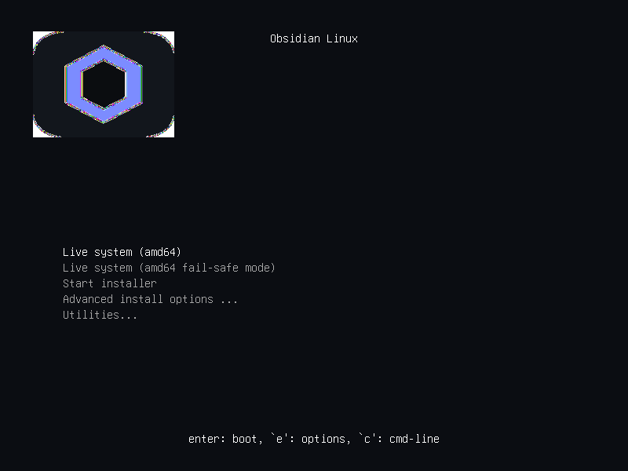

# Obsidian Linux

<p align="center">
  
</p>

<p align="center">
  A Debian 13, Wayland-first Linux distribution project focused on a lightweight Labwc desktop, reproducible ISO builds, and a branded Calamares installer.
</p>

<p align="center">
  
  
  <a href="https://www.debian.org/doc/"></a>
  
  
  
  
</p>

## Overview

Obsidian Linux is being developed as a modern Debian-based operating system with a restrained visual identity, a minimal default desktop, and a reproducible build pipeline. The current repository is centered on the distribution foundation: building a bootable live ISO, packaging Obsidian-specific customizations as Debian packages, and integrating a branded Calamares installer.

Obsidian Linux is a Debian reskin and derivative, not an independent upstream distribution. For Debian system administration, packaging, and user documentation, see the [official Debian documentation](https://www.debian.org/doc/).

Brand consistency is enforced from the canonical [Obsidian logo](branding/logos/obsidian-logo.svg): the README, desktop icons, Calamares assets, and GRUB splash all use that mark. The animated [loading indicator](branding/assets/obsidian-loading.svg) follows the same violet-on-obsidian palette and honors reduced-motion preferences.

This repository does not yet claim a completed operating system. It documents and packages the current buildable foundation only.

## Current Status

- Phase: `0.2.0 Development Preview`
- Scope verified in-repo: live-build configuration, package sources, branding assets, installer configuration, and developer documentation
- Automated Linux CI: Ubuntu package build and validation workflow via GitHub Actions
- Scope still pending external verification: real Debian-host package builds, ISO boot verification, and live screenshot capture

## Hero Screenshot

Real screenshots are required for this project and are intentionally not replaced with mockups. The capture workflow is documented in [docs/screenshot-workflow.md](/C:/Users/matth/OneDrive/Desktop/company/obsidian-linux/docs/screenshot-workflow.md), and verified screenshots should be stored in [docs/images](/C:/Users/matth/OneDrive/Desktop/company/obsidian-linux/docs/images).



## Feature Highlights

- Debian 13 (Trixie) base with a reproducible `live-build` pipeline
- Wayland-first Labwc desktop with Waybar, Wofi, Foot, and Thunar
- Obsidian Center for lightweight system overview and core launch actions
- Obsidian System Tools for maintenance, diagnostics, health, and resource checks
- Obsidian Desktop Tools for screenshots, recording, clipboard, QR, and quick status
- Obsidian Developer Tools for opt-in language, container, database, and CLI setup
- Obsidian Software Store for curated APT installs
- Calamares installer integration with Obsidian branding
- Lightweight first-run welcome flow for initial orientation
- Customizations delivered through Debian packages rather than ad hoc image edits
- Structured build, validation, and test documentation

## How the Desktop Starts

There are two similarly named desktop-entry files in this project, but they serve completely different purposes. The distinction matters when changing the live image or debugging why a session does not start.

### The Obsidian desktop session

The actual Wayland session is defined by [packages/obsidian-desktop/src/usr/share/wayland-sessions/obsidian.desktop](/C:/Users/matth/OneDrive/Desktop/company/obsidian-linux/packages/obsidian-desktop/src/usr/share/wayland-sessions/obsidian.desktop). A display manager reads this file to show **Obsidian** as a login-session choice.

That entry starts [start-obsidian-session](/C:/Users/matth/OneDrive/Desktop/company/obsidian-linux/packages/obsidian-desktop/src/usr/bin/start-obsidian-session), which prepares the user environment and launches Labwc. The Labwc configuration in `packages/obsidian-desktop/src/etc/xdg/labwc/` defines keybindings, the root menu, autostart behavior, and window-management defaults. Waybar, Wofi, Foot, Mako, Thunar, and the other desktop components are configured by the same `obsidian-desktop` package.

```text
Display manager
  -> wayland-sessions/obsidian.desktop
    -> start-obsidian-session
      -> Labwc + Waybar + desktop configuration
```

### The installer shortcut

[install-obsidian-linux.desktop](/C:/Users/matth/OneDrive/Desktop/company/obsidian-linux/packages/obsidian-desktop/src/usr/share/applications/install-obsidian-linux.desktop) is **not** the desktop session. It is an application-menu and desktop shortcut that launches the Calamares installer with elevated privileges. It is available only to install Obsidian Linux from the live environment.

```text
install-obsidian-linux.desktop
  -> pkexec calamares
  -> install Obsidian Linux to a disk
```

If you want to change the look, startup behavior, keyboard bindings, panel, launcher, notifications, or session behavior, edit `packages/obsidian-desktop`. If you want to change the installation flow, edit `packages/obsidian-calamares-settings` and the `calamares/` source configuration.

## Packages and Build Artifacts

The repository deliberately separates package source code from generated package files:

- `packages/` is the tracked source tree. Each `packages/obsidian-*` directory is a Debian source package containing its payload under `src/` and its package metadata under `debian/`.
- `build/artifacts/` is the ignored output directory for generated `.deb` files. It is recreated by `scripts/build-packages.sh` and should not be edited or committed.

For example, the main desktop source package lives at `packages/obsidian-desktop/`, while a built file such as `obsidian-desktop_0.1.0-1_all.deb` appears only under `build/artifacts/` after a successful build.

## Installation Overview

The current goal is to build and test the live ISO in a virtual machine before any hardware deployment.

```bash
git clone <repository>
cd obsidian-linux
sudo ./scripts/install-build-dependencies.sh
./scripts/build-packages.sh
sudo ./scripts/build-iso.sh
./scripts/test-iso.sh
```

Expected output:

```text
dist/obsidian-linux-amd64.iso
dist/obsidian-linux-amd64.iso.sha256
```

## Build Instructions

Build details are documented in:

- [docs/build-guide.md](/C:/Users/matth/OneDrive/Desktop/company/obsidian-linux/docs/build-guide.md)
- [docs/package-guide.md](/C:/Users/matth/OneDrive/Desktop/company/obsidian-linux/docs/package-guide.md)
- [docs/testing-guide.md](/C:/Users/matth/OneDrive/Desktop/company/obsidian-linux/docs/testing-guide.md)

## Repository Structure

```text
.
├── assets/
├── branding/
├── build/
├── calamares/
├── dist/
├── docs/
├── live-build/
├── packages/
└── scripts/
```

## Desktop Editions

- `Obsidian Core`: current implementation target for the Labwc-based live ISO
- `Obsidian Plasma`: planned future edition, not implemented in this repository state
- `Obsidian Hypr`: planned future edition, not implemented in this repository state

## Screenshots

The repository is prepared for real screenshots only. Required capture targets and storage conventions are documented in:

- [docs/screenshot-workflow.md](/C:/Users/matth/OneDrive/Desktop/company/obsidian-linux/docs/screenshot-workflow.md)
- [docs/images/README.md](/C:/Users/matth/OneDrive/Desktop/company/obsidian-linux/docs/images/README.md)

## Architecture Diagrams

- [docs/diagrams/build-pipeline.md](/C:/Users/matth/OneDrive/Desktop/company/obsidian-linux/docs/diagrams/build-pipeline.md)
- [docs/diagrams/package-structure.md](/C:/Users/matth/OneDrive/Desktop/company/obsidian-linux/docs/diagrams/package-structure.md)
- [docs/diagrams/live-build-flow.md](/C:/Users/matth/OneDrive/Desktop/company/obsidian-linux/docs/diagrams/live-build-flow.md)
- [docs/diagrams/installer-flow.md](/C:/Users/matth/OneDrive/Desktop/company/obsidian-linux/docs/diagrams/installer-flow.md)
- [docs/diagrams/boot-sequence.md](/C:/Users/matth/OneDrive/Desktop/company/obsidian-linux/docs/diagrams/boot-sequence.md)
- [docs/diagrams/repository-layout.md](/C:/Users/matth/OneDrive/Desktop/company/obsidian-linux/docs/diagrams/repository-layout.md)

## Roadmap

- Complete Debian-host validation of package builds and ISO generation
- Capture and version real screenshots from the running live system
- Add release automation and published artifacts after the foundation is verified

## Contributing

Contribution guidance lives in [CONTRIBUTING.md](/C:/Users/matth/OneDrive/Desktop/company/obsidian-linux/CONTRIBUTING.md). Please also read the [CODE_OF_CONDUCT.md](/C:/Users/matth/OneDrive/Desktop/company/obsidian-linux/CODE_OF_CONDUCT.md) and [SECURITY.md](/C:/Users/matth/OneDrive/Desktop/company/obsidian-linux/SECURITY.md).

## License

This project is licensed under the MIT License. See [LICENSE](/C:/Users/matth/OneDrive/Desktop/company/obsidian-linux/LICENSE).

## Credits

- Debian, for the upstream base system and packaging ecosystem
- `live-build`, for reproducible live image composition
- Labwc, Waybar, Wofi, Foot, Thunar, and Calamares upstream projects
