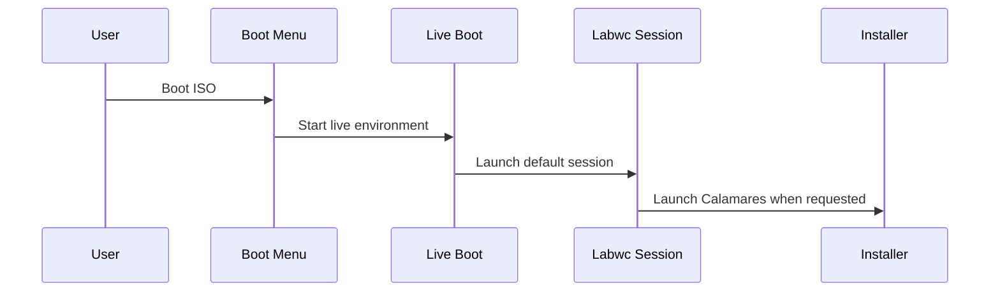

# Boot Sequence

```mermaid
sequenceDiagram
  participant U as User
  participant B as Boot Menu
  participant L as Live Boot
  participant S as Labwc Session
  participant I as Installer

  U->>B: Boot ISO
  B->>L: Start live environment
  L->>S: Launch default session
  S->>I: Launch Calamares when requested
```
