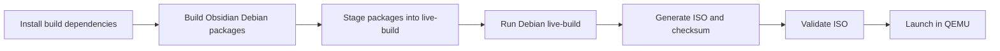

# Build Pipeline

```mermaid
flowchart LR
  A[Install build dependencies] --> B[Build Obsidian Debian packages]
  B --> C[Stage packages into live-build]
  C --> D[Run Debian live-build]
  D --> E[Generate ISO and checksum]
  E --> F[Validate ISO]
  F --> G[Launch in QEMU]
```
