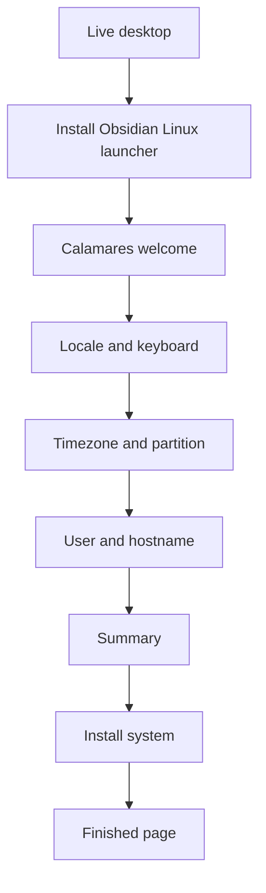

# Installer Flow

```mermaid
flowchart TD
  A[Live desktop] --> B[Install Obsidian Linux launcher]
  B --> C[Calamares welcome]
  C --> D[Locale and keyboard]
  D --> E[Timezone and partition]
  E --> F[User and hostname]
  F --> G[Summary]
  G --> H[Install system]
  H --> I[Finished page]
```
