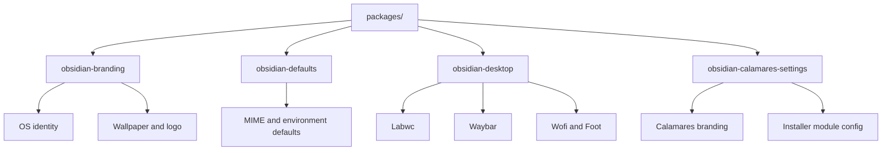

# Package Structure

```mermaid
graph TD
  A[packages/] --> B[obsidian-branding]
  A --> C[obsidian-defaults]
  A --> D[obsidian-desktop]
  A --> E[obsidian-calamares-settings]
  B --> B1[OS identity]
  B --> B2[Wallpaper and logo]
  C --> C1[MIME and environment defaults]
  D --> D1[Labwc]
  D --> D2[Waybar]
  D --> D3[Wofi and Foot]
  E --> E1[Calamares branding]
  E --> E2[Installer module config]
```
