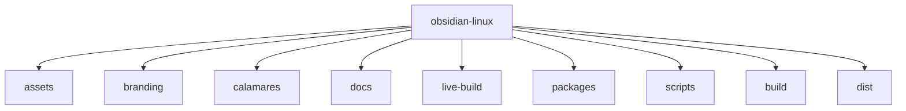

# Repository Layout

```mermaid
graph TD
  A[obsidian-linux] --> B[assets]
  A --> C[branding]
  A --> D[calamares]
  A --> E[docs]
  A --> F[live-build]
  A --> G[packages]
  A --> H[scripts]
  A --> I[build]
  A --> J[dist]
```
